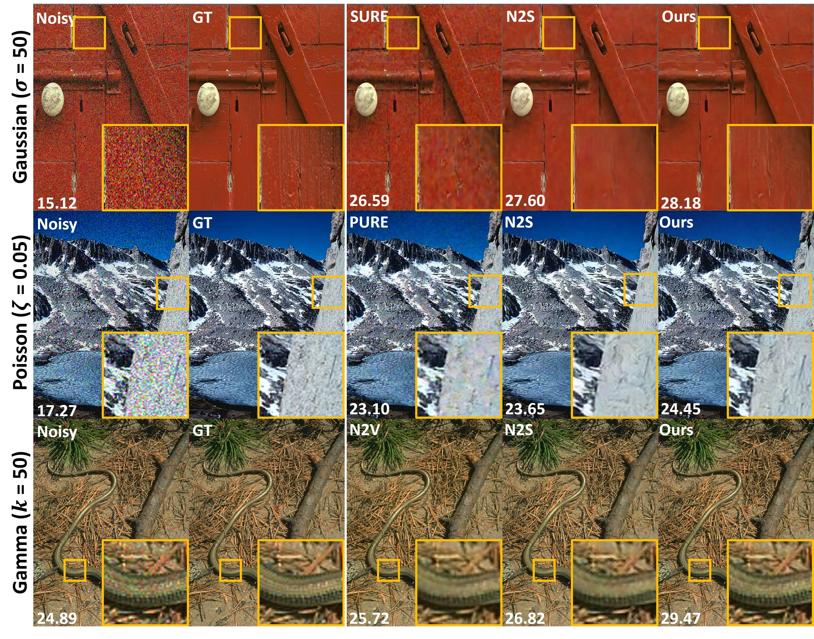

# Noise2Score: Tweedie’s Approach to Self-Supervised Image Denoising without Clean Images [NeurIPS2021]

This repository is the official implementation of *Noise2Score: Tweedie’s Approach to Self-Supervised Image Denoising without Clean Images* [[paper]](https://arxiv.org/abs/2106.07009) 


</img>

## Abstract
In this work, we provided a novel Bayesian framework for self-supervised image denoising without
clean data, which surpasses SURE, PURE, Noise2X, etc. Our novel innovation came from the
Tweedie’s formula, which provides explicit representation of denoise images through the score
function. By combining with the score-function estimation using AR-DAE, our Noise2Score can be
applied to image denoising problem from any exponential family noises. Furthermore, an identical
neural network training can be universally used regardless of the noise models, which leads to the
noise parameter estimation with minimal complexity. The links to SURE and existing Noise2X were
also explained, which clearly showed why our method is a better generalization.


</img>

## Requirements

To install requirements:

```setup
conda env create -f noise2score.yml
conda activate noise2score
```

>📋  If you install anaconda package, it is possible to meet the prerequirements by running abobe code.

## Data
We generated synthetic noise images for each noise distribution. The trainset was set to DIVK2 and CBSD400. 
For the gray-scale image case, we transfrom the color images into grasy-scale images and generate the noisy images for each noise model. We provided the generation sourcecode "Datageneration.ipynb"


## Training

To train the model(s) in the paper for additive Gaussian noise, run this command:

```train
python train.py --model Gaussian --parameter 25  --dataroot /your_path/ --name BSD_ours_unet_25 --gpu_ids '0' --direction BtoA 
```
To train the model(s) in the paper for Poisson noise, run this command:

```train
python train.py --model Poisson --parameter 0.01  --dataroot /your_path/ --name BSD_ours_unet_0.01 --gpu_ids '0' --direction BtoA 
```

To train the model(s) in the paper for Gamma noise, run this command:

```train
python train.py --model Gamma --parameter 100  --dataroot /your_path/ --name BSD_ours_unet_100 --gpu_ids '0' --direction BtoA 
```

>📋  Dataroot "your_path" depends on the your data path.

## Evaluation

To evaluate my model on test dataset for the Gaussian case, run:

```eval
python test.py --model Gaussian --parameter 25 --dataroot /your_path/ --name BSD_ours_unet_25 --model Gaussian --direction BtoA  --gpu_ids '0' --epoch best --results_dir /your_results/
```

To evaluate my model on test dataset for the Poisson case, run:

```eval
python test.py --model Poisson --parameter 0.01 --dataroot /your_path/ --name BSD_ours_unet_0.01 --model Poisson --direction BtoA  --gpu_ids '0' --epoch best --results_dir /your_results/
```

To evaluate my model on test dataset for the Gamma case, run:
```eval
python test.py --model Gamma --parameter 100 --dataroot /your_path/--name BSD_ours_unet_100 --model Gamma --direction BtoA  --gpu_ids '0' --epoch best --results_dir /your_results/
```

>📋  Dataroot "your_path" depends on the your data path for test dataset such as CBSD68, Kodak. Change "--result_dir" to save results of image on your device 

## Pre-trained Models

You can download pretrained models [here](https://drive.google.com/drive/folders/1wp5AAPC9E1U9TZaQiPfb8T_4Qu-gAXR2?usp=sharing) 

To brifely evaluate Noise2Score given pretrained weight, we provided the Set12 Dataset for gaussian, poisson, gamma noisy and target pairs. 

Firrst, put in pretrained weights into checkpoints folder.

In case of Non-blind noise:

run:
```
python test.py --model Gaussian --parameter 25 --dataroot ./testdata/Set12 --name BSD_ours_unet_25 --direction BtoA  --gpu_ids '0' --epoch best --results_dir ./results/
```
```
python test.py --model Poisson  --scale_param 0.01 --dataroot ./testdata/Set12 --name BSD_ours_unet_0.01 --direction BtoA  --gpu_ids '0' --epoch best --results_dir ./results/
```
```
python test.py --model Gamma --parameter 100 --dataroot ./testdata/Set12 --name BSD_ours_unet_gamma_100 --direction BtoA  --gpu_ids '0' --epoch best --results_dir ./results/
```

In case of Blind noise: 

run:
```
python test_blind.py --model Gaussian_blind --parameter 25 --dataroot ./testdata/Set12 --name BSD_ours_unet_25_blind --direction BtoA  --gpu_ids '0' --epoch best --results_dir ./results/
```
```
python test_blind.py --model Poisson_blind  --scale_param 0.01 --dataroot ./testdata/Set12 --name BSD_ours_unet_0.01_blind --direction BtoA  --gpu_ids '0' --epoch best --results_dir ./results/
```
```
python test_blind.py --model Gamma_blind --parameter 100 --dataroot ./testdata/Set12 --name BSD_ours_unet_gamma_100_blind --direction BtoA  --gpu_ids '0' --epoch best --results_dir ./results/
```

## Citation
If you find our work interesting, please consider citing
```
@article{kim2021noise2score,
  title={Noise2score: tweedie’s approach to self-supervised image denoising without clean images},
  author={Kim, Kwanyoung and Ye, Jong Chul},
  journal={Advances in Neural Information Processing Systems},
  volume={34},
  pages={864--874},
  year={2021}
}
```

